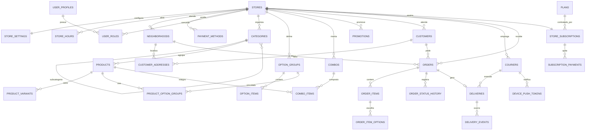

# Arquitetura Física do Banco — Pediu Aqui (Fase 04)

> Fonte de verdade estrutural. Complementa `PROJECT_MASTER_PLAN.md`, seção 25.
> Data: 2026-07-30 · Fase: 04 concluída.

## 1. Princípios aplicados

| Princípio | Como foi implementado |
| --- | --- |
| Tenant é a loja | Toda tabela operacional possui `store_id NOT NULL` referenciando `stores` |
| Isolamento estrutural | Cada tabela de loja tem `UNIQUE (id, store_id)`; todos os relacionamentos usam **chave estrangeira composta** `(filho_id, store_id) → (id, store_id)` |
| Entidades globais sem `store_id` artificial | `plans`, `user_profiles` |
| Papéis fora do perfil | `user_roles` separada; `user_profiles` não possui coluna de papel |
| Negação por padrão | RLS habilitada e **forçada** em 100% das tabelas, com **zero policies** e sem `GRANT` a `anon`/`authenticated` |
| Preço nunca vem do cliente | Snapshots congelados em `orders`, `order_items`, `order_item_options` |
| Catálogo genérico | Nenhuma tabela de segmento; opções resolvidas por `option_groups` + `option_items` |
| Sem financeiro de entregador | `couriers` não guarda valores nem contadores; entregas concluídas são derivadas via `courier_completed_deliveries_count(courier_id, store_id)` e da view `courier_delivery_counts` |

## 2. Chave estrangeira composta — por que

Uma FK simples (`product_id → products.id`) permite, por erro de aplicação ou por policy mal escrita, vincular um produto da Loja A a um pedido da Loja B. A FK composta torna isso **impossível no nível do banco**:

```sql
CONSTRAINT products_category_same_store_fk
  FOREIGN KEY (category_id, store_id) REFERENCES public.categories(id, store_id)
```

O isolamento passa a ser estrutural, não apenas de política.

## 3. Tipos de domínio (enums)

| Enum | Valores |
| --- | --- |
| `store_status` | em_implantacao, ativa, suspensa, inativa |
| `fulfillment_type` | entrega, retirada |
| `order_status` | aguardando_confirmacao, aceito, em_preparo, pronto, aguardando_entregador, saiu_para_entrega, entregue, aguardando_retirada, retirado, recusado, cancelado |
| `app_role` | admin_plataforma, proprietario, gerente, atendente, cozinha, entregador |
| `option_selection_type` | unica, multipla |
| `pricing_unit` | unidade, quantidade, peso |
| `payment_method_kind` | dinheiro, cartao_credito, cartao_debito, pix, vale_refeicao, outro |
| `promotion_type` | percentual, valor_fixo |
| `courier_status` | ativo, inativo |
| `delivery_status` | pendente, atribuida, aceita, coletada, em_rota, concluida, cancelada |
| `delivery_event_type` | atribuida, aceita, chegada_loja, coleta, inicio_entrega, tentativa_falha, ocorrencia, concluida, cancelada |
| `subscription_status` | ativa, inadimplente, suspensa, cortesia, cancelada |
| `subscription_payment_status` | pago, pendente, cortesia, estornado |

## 4. ERD



## 5. Máquina de estados do pedido

Implementada estruturalmente pelo enum `order_status` e auditada por `order_status_history` (`from_status`, `to_status`, `actor_kind`, `reason`). A validação das transições vive em `src/domain/types.ts` (`ORDER_TRANSITIONS`) e será aplicada no servidor na fase de pedidos.

Estados finais: `entregue`, `retirado`, `recusado`, `cancelado`.

## 6. Restrições nomeadas relevantes

| Constraint | Garante |
| --- | --- |
| `stores_slug_format_check` | slug em kebab-case, 3–60 caracteres |
| `orders_total_consistency_check` | `total = subtotal + taxa − desconto` |
| `orders_pickup_no_fee_check` | retirada nunca cobra taxa de entrega |
| `orders_delivery_requires_address_check` | entrega exige snapshot de endereço |
| `orders_idempotency_unique` | impede pedido duplicado por reenvio |
| `orders_tracking_token_key` | token público único |
| `deliveries_order_unique` | uma entrega por pedido — impede aceite duplo |
| `user_roles_scope_check` | admin da plataforma é global; demais papéis exigem loja |
| `option_groups_min_max_check` / `_required_check` / `_single_check` | regras de min/max coerentes |
| `customer_addresses_number_check` | número obrigatório salvo quando "sem número" |
| `customers_phone_format_check` | telefone apenas com dígitos, 10–13 |

## 7. Segurança nesta fase

- RLS **habilitada e forçada** nas 30 tabelas de `public`.
- **Zero policies** — nenhuma linha é legível ou gravável pela API de dados.
- `REVOKE ALL ... FROM anon, authenticated` explícito em todas as tabelas.
- `GRANT ALL ... TO service_role` apenas, para operações internas de servidor.
- `public_tracking_token` gerado com `gen_random_bytes(24)` (48 caracteres hex), nunca derivado de telefone, id ou data.
- `audit_logs.context` possui comentário SQL listando o que é proibido gravar.
- `device_push_tokens.token` marcado como sensível por comentário SQL.
- `set_updated_at()` é `SECURITY INVOKER` com `search_path` fixo.

> O linter reporta "RLS habilitada sem policy" como informativo em todas as tabelas. **Isso é o resultado desejado da Fase 04**: negação por padrão. As policies entram na Fase 06.

## 8. Seed de validação

Cinco lojas fictícias provam que o catálogo genérico atende segmentos distintos sem nenhuma tabela específica:

| Loja | Modelo | Estrutura exercitada |
| --- | --- | --- |
| Brasa Urbana | Hamburgueria | grupo múltiplo com quantidade (adicionais) |
| Forno di Pietra | Pizzaria | variações de tamanho + grupo múltiplo limitado (sabores) + grupo único obrigatório (borda) |
| Casa da Marmita | Marmitaria | variações P/M/G + grupo único obrigatório (proteína) + grupo múltiplo (acompanhamentos) |
| Açaí do Cerrado | Açaiteria | variações de volume + complementos com preço adicional |
| Mercado Aurora | Mercado | venda por peso (kg) e por unidade, sem grupos de opções |

O seed é **idempotente**: não executa se já existir qualquer loja.

## 9. Asserções automáticas executadas

- Exatamente 5 lojas de validação.
- Nenhuma tabela operacional sem `store_id`.
- Nenhuma tabela de `public` sem RLS.
- Nenhuma policy existente na Fase 04.
- `plans` sem `store_id`.
- `user_profiles` sem coluna de papel/permissão.
- Nenhuma tabela de segmento (`pizza_flavors`, `acai_complements`, `burger_addons`, `marmita_proteins`).
- Nenhum campo financeiro em `couriers`, `deliveries` ou `delivery_events`.
- Nenhum token de acompanhamento com menos de 32 caracteres.

## 10. Fronteiras respeitadas

Nada de telas conectadas ao banco, autenticação, Realtime, Storage, Edge Functions ou dados reais. O protótipo da Fase 03 continua usando `src/demo/`.
